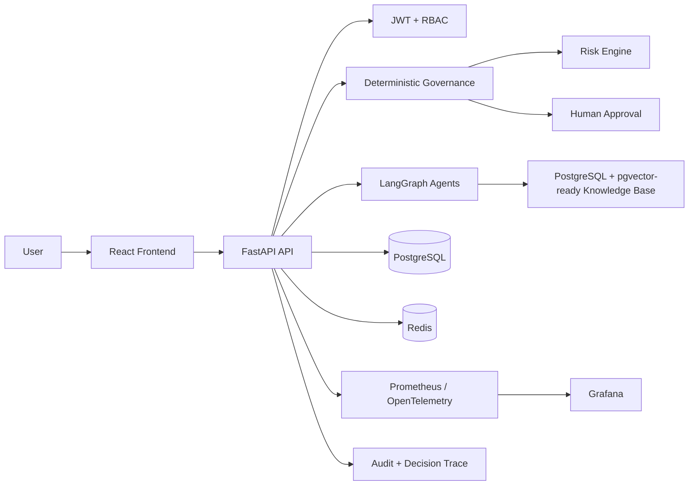
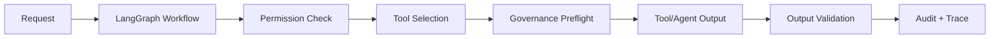
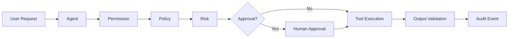
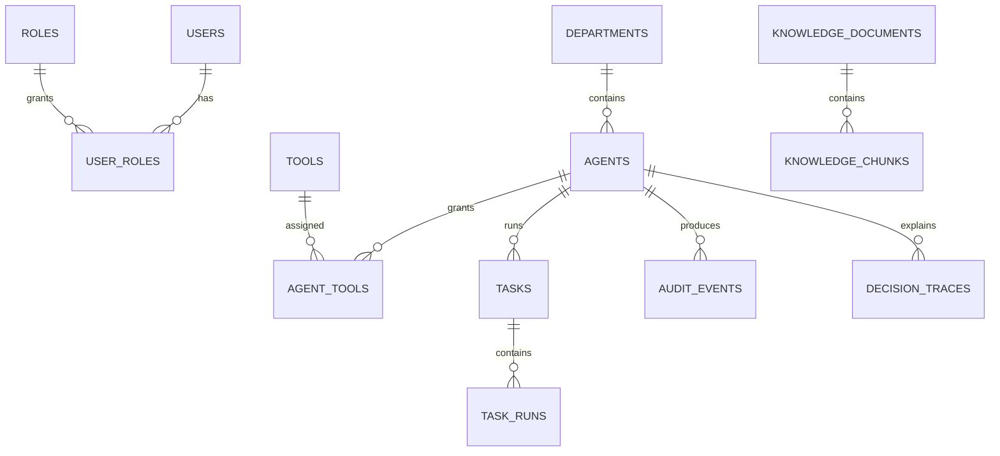
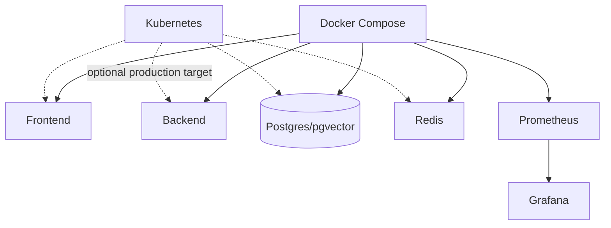
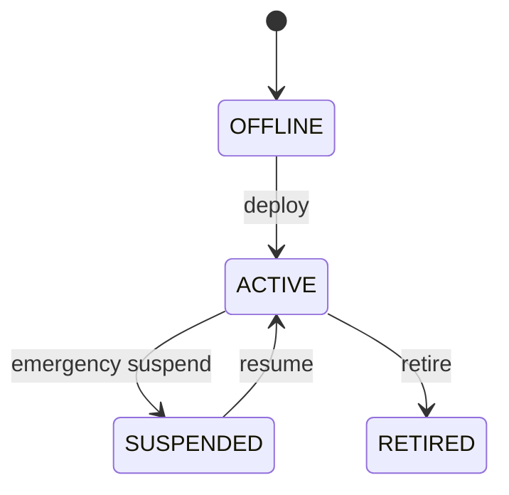
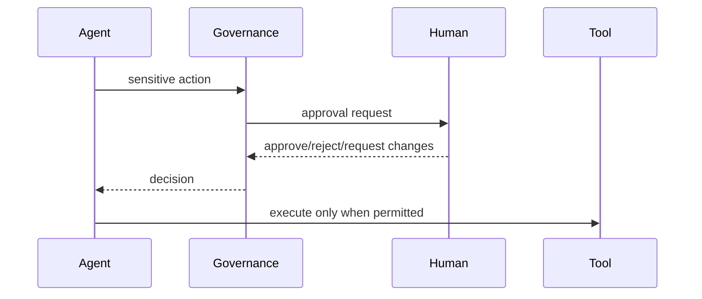

# Architecture

## System Architecture

```mermaid
flowchart LR
 U[User] --> F[React Frontend]
 F --> API[FastAPI API]
 API --> AUTH[JWT + RBAC]
 API --> GOV[Deterministic Governance]
 GOV --> RISK[Risk Engine]
 GOV --> APP[Human Approval]
 API --> AG[LangGraph Agents]
 AG --> RAG[PostgreSQL + pgvector-ready Knowledge Base]
 API --> DB[(PostgreSQL)]
 API --> REDIS[(Redis)]
 API --> OBS[Prometheus / OpenTelemetry]
 OBS --> G[Grafana]
 API --> AUD[Audit + Decision Trace]
```

## Agent Architecture

```mermaid
flowchart LR
 R[Request] --> W[LangGraph Workflow]
 W --> P[Permission Check]
 P --> T[Tool Selection]
 T --> G[Governance Preflight]
 G --> O[Tool/Agent Output]
 O --> V[Output Validation]
 V --> A[Audit + Trace]
```

## Governance Flow

```mermaid
flowchart LR
 R[User Request]-->A[Agent]-->P[Permission]-->C[Policy]-->Risk[Risk]-->H{Approval?}
 H-->|Yes|Q[Human Approval]
 H-->|No|X[Tool Execution]
 Q-->X-->V[Output Validation]-->L[Audit Event]
```

## Database ER Diagram

```mermaid
erDiagram
 USERS ||--o{ USER_ROLES : has
 ROLES ||--o{ USER_ROLES : grants
 DEPARTMENTS ||--o{ AGENTS : contains
 AGENTS ||--o{ AGENT_TOOLS : grants
 TOOLS ||--o{ AGENT_TOOLS : assigned
 AGENTS ||--o{ TASKS : runs
 TASKS ||--o{ TASK_RUNS : contains
 AGENTS ||--o{ AUDIT_EVENTS : produces
 AGENTS ||--o{ DECISION_TRACES : explains
 KNOWLEDGE_DOCUMENTS ||--o{ KNOWLEDGE_CHUNKS : contains
```

## Deployment Architecture

```mermaid
flowchart TB
 D[Docker Compose]-->FE[Frontend]
 D-->BE[Backend]
 D-->PG[(Postgres/pgvector)]
 D-->R[Redis]
 D-->P[Prometheus]
 P-->G[Grafana]
 K[Kubernetes]-.optional production target .->BE
 K-.->FE
 K-.->PG
 K-.->R
```

## Agent Lifecycle

```mermaid
stateDiagram-v2
 [*] --> OFFLINE
 OFFLINE --> ACTIVE: deploy
 ACTIVE --> SUSPENDED: emergency suspend
 SUSPENDED --> ACTIVE: resume
 ACTIVE --> RETIRED: retire
```

## Human Approval Flow

```mermaid
sequenceDiagram
 participant A as Agent
 participant G as Governance
 participant H as Human
 participant T as Tool
 A->>G: sensitive action
 G->>H: approval request
 H-->>G: approve/reject/request changes
 G-->>A: decision
 A->>T: execute only when permitted
```
